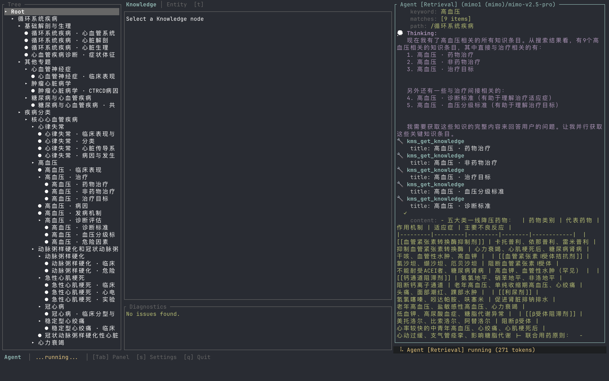

# Dendrite 智能体知识增量管理系统

> 个人项目记录 · 状态：进行中（截至 2026-06）

一个基于 AI Agent 的**树形索引知识管理系统（KMS）**。Agent 通过诊断反馈驱动的方式，
在 SQLite 知识树上持续构建、检索、修复结构化知识。设计目标是让知识像神经元一样
**沿着索引树的轴突不断延伸**，而不是堆在扁平文档里。



---

## 目录

- [设计理念](#设计理念)
- [三层数据模型](#三层数据模型)
- [诊断系统](#诊断系统)
- [三类 Agent 角色](#三类-agent-角色)
- [Agent ↔ KMS 闭环](#agent--kms-闭环)
- [KMS 工具集](#kms-工具集)
- [TUI 界面](#tui-界面)
- [项目结构](#项目结构)
- [快速开始](#快速开始)
- [配置](#配置)
- [扩展指南](#扩展指南)
- [已知问题 / 未来工作](#已知问题--未来工作)

---

## 设计理念

核心假设：知识的可用性不取决于它写得多详细，而取决于它在索引树中的**位置是否正确**。
所以系统有两块同等重要的设计：

1. **树形索引优先于知识本身**。Agent 在写知识前必须先审视并修复索引结构，
   任何"找不到合适位置"的情况都被视作索引树需要生长的信号，而不是绕过信号的理由。
2. **诊断反馈驱动自愈**。每次 KMS 写操作后自动重跑诊断，**问题数量变化**作为
   Agent 上下文注入信号，让 Agent 在交互循环里持续修复结构。

底层基础设施（agent runtime、LLM SDK、类型系统）**全部抽到独立的 `agentik-*` 仓库**，
DMS 本体（`kms` / `kms_tui` / `dendrite-tools` / `agent-compose` / `agent-knowledge`）
只关心知识领域。这样 KMS 本身保持薄、可读、可独立测试。

---

## 三层数据模型

```
Index (索引树骨架)
  ├── Group 节点（带子节点的内部节点）
  └── Knowledge 节点（叶子，挂载一条知识）
        └── Knowledge 引用 Entity（≥1 个）
```

| 层级 | 角色 | 关键约束 |
|------|------|---------|
| **Entity** | 讨论的对象 | 必须有至少一个命名（语言 + 全称 + 可选缩写） |
| **Knowledge** | 关于实体的记录 | `aspect`（单实体切面）或 `relation`（多实体关系）<br/>`entities` 字段列出**所有**被提及的实体<br/>内容用 `[[实体名]]` 维基风格标注 |
| **Index** | 树状组织层 | 兄弟节点抽象级别对等、不重叠；内部节点不直接挂知识 |

**典型组织**：

```
心血管疾病
├── 冠心病
│   ├── 冠心病 · 定义            ─┐
│   ├── 冠心病 · 诊断标准         │  Knowledge 节点
│   ├── 冠心病 · 药物治疗        ─┘
│   └── ...
├── 心力衰竭
│   ├── 急性心力衰竭
│   │   ├── 急性心力衰竭 · 病因
│   │   └── 急性心力衰竭 · 药物治疗
│   └── 慢性心力衰竭
│       └── ...
```

知识粒度强制要求**一个标题 = 一个切面**。禁止用"和 / 与 / 及"等连接词合并多个切面
（"诊断与治疗"、"病因和发病机制"等都视为违规）。这条规则在 system prompt 和
diagnostic 规则中双重强制。

---

## 诊断系统

> 类似编译器的类型检查器——KMS 写操作后自动重跑，把结构违规反馈给 Agent。

### 核心类型

```rust
pub enum Severity { Error, Warning, Information, Hint }

pub struct Diagnostic {
    pub code: String,                         // 规则标识
    pub code_description: Option<CodeDescription>, // 诊断码 URI: kms://diagnostics/{domain}/{rule}
    pub location: String,                      // 知识树路径
    pub severity: Severity,
    pub message: String,
    pub suggested_actions: Vec<String>,        // 推荐修复步骤（直接引用 KMS tool 名）
}
```

### 规则清单

#### Entity 规则（`crates/kms/src/diagnostics/entity_rules.rs`）

| 规则 | Code | 严重级 | 检测条件 |
|------|------|--------|----------|
| `NoNomenclature` | `entity.no_nomenclature` | Error | 实体命名向量为空 |
| `EmptyDefinition` | `entity.empty_definition` | Warning | 定义字段为空字符串 |
| `MissingZhNomenclature` | `entity.missing_zh_nomenclature` | Hint | 缺少中文（ZH）命名 |

#### Index 规则（`crates/kms/src/diagnostics/index_rules.rs`）

| 规则 | Code | 严重级 | 检测条件 |
|------|------|--------|----------|
| `EmptyLeaf` | `index.empty_leaf` | Warning | Group 节点无子节点且无知识关联（depth>0） |
| `ExcessiveChildren` | `index.excessive_children` | Warning | 子节点数 > 6 |
| `InconsistentPrefixes` | `index.inconsistent_prefixes` | Hint | Knowledge 子节点标题前缀（`·` 前的实体名）分布零散 |

#### Knowledge 规则（`crates/kms/src/diagnostics/knowledge_rules.rs`）

| 规则 | Code | 严重级 | 检测条件 |
|------|------|--------|----------|
| `NestedKnowledge` | `knowledge.internal_nested` | Warning | 内容含多个 Markdown 标题（应保持扁平，结构外移到 index） |
| `VagueTitle` | `knowledge.vague_title` | Warning | 标题后缀含模糊关键词（"概述"、"定义"、"简介" 等） |
| `OrphanKnowledge` | `knowledge.orphan` | （占位） | 当前未启用 |
| `EmptyContent` | `knowledge.empty_content` | Hint | 内容为空 |
| `NoEntities` | `knowledge.no_entities` | Warning | 关联实体列表为空 |
| `BoldAsHeading` | `knowledge.bold_as_heading` | Error | 用 `**粗体**` 独占一行充当标题 |
| `TitleMissingEntityPrefix` | `knowledge.title_missing_entity_prefix` | Warning | 标题未含 `·` 分隔符（即无实体名前缀） |

诊断结果在 TUI 的 `Diagnostics` 面板实时显示，每条都带可执行的 `suggested_actions`
（直接告诉 Agent 用哪个 `kms_*` 工具修复）。

---

## 三类 Agent 角色

`kms_tui` 同时跑三个独立的 Agent，可通过 `[Tab]` 切换上下文焦点：

| 角色 | Crate | 工具子集 | 用途 |
|------|-------|----------|------|
| **Compose** | `agent-compose` | 25 个 `kms_*` 工具（含写操作） | 知识**构建**专家。处理知识录入、索引调整、结构修复 |
| **Retrieval** | `agent-knowledge` | 8 个只读 `kms_*` 工具 | 只读**检索**专家。强制使用并行工具调用 + `attempt_complete` 模式 |
| **Parallel** | `agent-compose::ParallelComposeContext` | Compose 工具 + `kms_parallel_dispatch` | **编排**专家。把大任务切分给 N 个子 Agent 并行处理，最后汇总报告 |

### Parallel Subtree 编排模式

当用户输入是大块文本（例：上传《内科学》第 10 版整本），单 Agent 串行处理
可能跑几个小时。Parallel 模式的做法：

```
用户输入大文本
    ↓
Parallel Agent 分析领域边界（"心血管"、"呼吸系统"、"消化系统"…）
    ↓
调用 kms_parallel_dispatch(subtasks=[
  { staging_title: "心血管疾病", content: "第 X 章原文..." },
  { staging_title: "呼吸系统疾病", content: "第 Y 章原文..." },
  ...
])
    ↓
工具内部为每个子任务启动一个独立 sub-agent
  - 独立的 KmsService（pointer 钉在 staging area）
  - 共享同一个 ModelPool
  - 子 Agent 互不感知，天然不冲突
    ↓
所有子 Agent 完成后，staging subtree 合并到目标父节点（或保留在 Root 待人工处理）
    ↓
Parallel Agent 向用户报告各 subtree 的实体 / 知识条数
```

**关键设计**：
- 子 Agent 的 prompt 完整继承自 `KMS_SYSTEM_PROMPT`，行为与单 Agent 完全一致
- 进度通过 `ParallelProgressTx` 通道实时推送到 TUI 右侧子面板
- 数据库写隔离靠独立的 KmsService 实例 + staging subtree（不是 SQLite 事务）

---

## Agent ↔ KMS 闭环

这是整个系统的核心循环：

```
Agent 发出写操作工具调用（任意 kms_* 写工具）
    ↓
agent-compose 拦截（is_mutation_tool 判断）
    ↓
KMS 执行写操作
    ↓
KMS 自动重跑所有诊断规则
    ↓
诊断结果和"上一次的差集"注入 Agent 上下文
  - 新问题 → 提示 Agent 继续修复
  - 无变化 → 走正常流程
    ↓
Agent 继续
```

**只读工具不触发重诊断**（避免无意义的性能开销）。具体名单：

```rust
// crates/agent-compose/src/tools.rs
pub(crate) const READONLY_KMS_TOOLS: &[&str] = &[
    "kms_search_entity",
    "kms_navigate",
    "kms_get_entity_knowledge",
];
```

**诊断 → 修复建议** 链路：每条 diagnostic 的 `suggested_actions` 字段
直接写"使用 `kms_update_entity` 补充实体的定义"等命令式指引，
Agent 看到后能直接采取行动，不需要二次推理。

---

## KMS 工具集

所有 `kms_*` 工具定义在 `crates/dendrite-tools/src/kms_tools/` 下，每个工具一个文件，
通过 `ToolRegistration` 暴露给 `agentik-core` runtime。共 **25+ 个**：

### 实体（Entity）相关

- `kms_create_entity` / `kms_update_entity` / `kms_delete_entity`
- `kms_get_entity` / `kms_search_entity` / `kms_list_entities`
- `kms_add_nomenclature` / `kms_update_nomenclature` / `kms_delete_nomenclature`

### 知识（Knowledge）相关

- `kms_create_knowledge` / `kms_update_knowledge` / `kms_delete_knowledge`
- `kms_rename_knowledge` / `kms_get_knowledge` / `kms_get_entity_knowledge`
- `kms_link_orphans`（把未被引用的 knowledge 自动挂到合适位置）

### 索引（Index）相关

- `kms_create_index` / `kms_delete_index` / `kms_move_index` / `kms_navigate`
- `kms_reorganize_children`（把 N 个子节点按主题重新分组）
- `kms_merge_subtree`（合并 staging subtree 到目标父节点）
- `kms_view_local`（无状态局部视图，retrieval agent 首选）
- `kms_subtree_knowledge` / `kms_search_subtree`

### 编排（Parallel）专用

- `kms_parallel_dispatch`（在 Parallel agent 工具集里出现）

**只读子集**（`readonly_registrations`，retrieval agent 用）：

```
kms_search_entity, kms_navigate, kms_get_entity, kms_get_entity_knowledge,
kms_get_knowledge, kms_view_local, kms_subtree_knowledge, kms_search_subtree
```

---

## TUI 界面

基于 `ratatui` + `crossterm`。多面板布局（vim 风快捷键）：

| 面板 | 内容 |
|------|------|
| **Tree**（左上） | 知识树导航，可展开/折叠/跳转 |
| **Knowledge / Entity**（右上） | 当前选中节点的内容或关联实体详情 |
| **Agent**（下半屏） | 三个 Agent 的对话 / 工具调用 / 思考过程 |
| **Diagnostics**（左下） | 实时诊断结果，每条带修复建议 |

`Agent` 面板内嵌 **ParallelPanel**：Parallel agent 跑时实时显示每个子 Agent 的状态、
完成度、错误信息。子 Agent 的 LLM 响应**内联**到主面板（可滚动追溯）。

主题系统（`crates/kms_tui/src/theme/`）支持自定义配色，所有样式通过 `Theme` trait 注入。

**TUI 内的设置表单**（`Settings` modal）：

- 多个 LLM provider 同时管理（minimax / mimo / sensenova / 自定义 OpenAI-兼容）
- 每个 provider 独立 base_url + api_key
- Model pool 选择：把 N 个 provider 的 N 个模型组成 agent 的 fallback 链
- 配置持久化到 `data/settings.json`

---

## 项目结构

```
dendrite/
├── crates/
│   ├── kms/                  # KMS 本体：存储、视图、诊断、服务
│   │   ├── src/
│   │   │   ├── storage/      # SQLite schema + repository
│   │   │   ├── diagnostics/  # entity/index/knowledge 规则
│   │   │   ├── service.rs    # KmsService：写操作 + 诊断编排
│   │   │   ├── view.rs       # IndexView / LocalView（只读视图）
│   │   │   └── language.rs   # Language enum（ZH/EN/...）
│   │   └── Cargo.toml
│   │
│   ├── kms_tui/              # TUI 应用（bin: kms-tui）
│   │   ├── src/
│   │   │   ├── main.rs       # 入口：加载配置、构建 agent、跑 ratatui 循环
│   │   │   ├── components/   # tree / agent / diagnostics / settings / help
│   │   │   ├── input/        # 键盘事件、粘贴处理、按键映射
│   │   │   ├── theme/        # 主题 / 配色
│   │   │   ├── chat.rs       # ChatMessage 渲染
│   │   │   ├── parallel_panel.rs  # Parallel agent 子面板
│   │   │   └── ...
│   │   └── Cargo.toml
│   │
│   ├── dendrite-tools/       # KMS 领域工具（agentik-core 之外的扩展）
│   │   ├── src/
│   │   │   ├── kms_tools/    # 25+ 个 kms_* 工具，每个一个文件
│   │   │   └── parallel_progress.rs  # 进度推送通道
│   │   └── Cargo.toml
│   │
│   ├── agent-compose/        # 知识构建 agent 上下文（写模式）
│   │   ├── src/
│   │   │   ├── context.rs           # KmsContext（主 agent）
│   │   │   ├── subtree_context.rs   # SubTreeComposeContext（子 agent）
│   │   │   ├── parallel_context.rs  # ParallelComposeContext（编排 agent）
│   │   │   ├── prompt.rs            # KMS_SYSTEM_PROMPT（核心 prompt）
│   │   │   ├── subtree_prompt.rs    # 子 agent prompt 变体
│   │   │   ├── parallel_prompt.rs   # 编排 agent prompt
│   │   │   ├── diagnostics.rs       # KMS Diagnostic → runtime Diagnostic
│   │   │   └── tools.rs             # mutation tool 分类
│   │   └── Cargo.toml
│   │
│   └── agent-knowledge/      # 只读检索 agent 上下文
│       ├── src/
│       │   ├── context.rs    # KnowledgeContext
│       │   └── prompt.rs     # KNOWLEDGE_RETRIEVAL_PROMPT（并行调用 + attempt_complete）
│       └── Cargo.toml
│
├── data/                     # 运行时数据
│   ├── kms_sqlite.db         # SQLite 数据库
│   ├── settings.json         # TUI 设置（provider / model pool）
│   └── tui.log               # TUI 运行日志（可通过 KMS_LOG_PATH 重定向）
│
├── docs/
│   └── demo.png              # README 展示图
│
├── Cargo.toml                # workspace root
└── README.md
```

### 外部依赖（git submodule 形式）

```toml
# Cargo.toml workspace.dependencies
agentik-core = { git = "https://github.com/wjixiang/agentik-core.git" }   # agent runtime
agentik-sdk  = { git = "https://github.com/wjixiang/agentik-sdk.git" }    # LLM SDK
agentik-types = { git = "https://github.com/wjixiang/agentik-types.git" } # 共享类型
```

> 三个 agentik-* 仓库**必须**使用同一 git URL。Cargo 按 (name, version, source) 统一类型，
> 混用 URL 会导致 `AgentContext` / `ModelPool` / `ContentBlock` / `ToolRegistration`
> 类型不兼容，出现 duplicate compilation。

---

## 快速开始

### 前置依赖

- **Rust 1.75+**（Edition 2024，建议用 rustup 装 stable）
- **SQLite**（sqlx 自动管理 schema，无需手动建库）
- 任意一个 LLM provider 的 API key（minimax / mimo / sensenova / 自定义 OpenAI-兼容）

### 构建

```bash
git clone https://github.com/wjixiang/dendrite.git
cd dendrite
cargo build --release
```

### 启动

```bash
cargo run --release --bin kms-tui
```

首次启动会进入"needs configuration"模式，因为 `data/settings.json` 还不存在：

1. 按 `S` 打开设置 modal
2. 添加 provider（填 base_url + api_key）
3. 从该 provider 的模型列表里选一个或多个加入 model pool
4. 保存 → 自动重启 agent

之后正常对话即可，Agent 会在知识树上逐步构建内容。

### 数据库位置

- 默认：`data/kms_sqlite.db`
- 自定义：环境变量 `KMS_DB_PATH=/path/to/kms.db`

### 日志位置

- 默认：`data/tui.log`
- 优先级：`KMS_LOG_PATH` > `$XDG_DATA_HOME/kms/tui.log` > `$HOME/.local/share/kms/tui.log` > `data/tui.log`
- 级别：通过 `RUST_LOG` 控制（默认 DEBUG）

---

## 配置

### 完整 `data/settings.json` 示例

```json
{
  "providers": [
    {
      "id": "prov-18b69253390fdd3c",
      "display_name": "mimo1",
      "provider_type": "mimo",
      "api_key": "tp-xxx",
      "base_url": "https://token-plan-cn.xiaomimimo.com/anthropic"
    },
    {
      "id": "prov-18b6928a3756c36d",
      "display_name": "sensenova1",
      "provider_type": "sensenova",
      "api_key": "sk-xxx",
      "base_url": ""
    }
  ],
  "pool": [
    { "provider_id": "prov-18b69253390fdd3c", "model": "mimo-v2.5-pro" }
  ]
}
```

- `providers` 列表：可同时配置多个 provider，互不干扰
- `pool` 列表：agent 实际使用的模型链，**至少一项**才会构建 agent
- `provider_type`：决定 SDK 走哪条 HTTP 协议路径（`minimax` / `mimo` / `sensenova` / `custom`）
- `base_url`：为空时用 provider_type 内置的默认 base_url
- **不读环境变量**（除了 `KMS_DB_PATH` / `KMS_LOG_PATH` / `RUST_LOG`）：
  所有 provider 配置都通过 TUI 设置表单管理，避免泄露到 shell history

---

## 扩展指南

### 添加新的 KMS 工具

1. 在 `crates/dendrite-tools/src/kms_tools/` 新建 `kms_xxx.rs`
2. 实现 `ToolRegistration::registration(svc: Arc<KmsService>) -> ToolRegistration`
3. 在 `kms_tools.rs` 的 `registrations()` / `readonly_registrations()` 里注册

只读工具应放进 `readonly_registrations()` —— retrieval agent 会用它，
且只读工具不触发 post-mutation 诊断。

### 添加新的诊断规则

1. 在 `crates/kms/src/diagnostics/{entity,index,knowledge}_rules.rs` 加结构体
2. 实现对应 trait（`EntityDiagnosticRule` / `IndexDiagnosticRule` / `KnowledgeDiagnosticRule`）
3. 在 `runner.rs` 的 `rules` 向量里 push 进去

```rust
pub trait EntityDiagnosticRule: Send + Sync {
    fn check(&self, entity: &Entity) -> Option<Diagnostic>;
    fn name(&self) -> &str;
}
```

诊断码 URI 规范：`kms://diagnostics/{domain}/{rule-name}`，
`code_description.href` 必须遵循此格式，方便后续接入 LSP / docs。

### 调整 Agent Prompt

- 主 agent（Compose）：`crates/agent-compose/src/prompt.rs` 的 `KMS_SYSTEM_PROMPT`
- 子 agent：`crates/agent-compose/src/subtree_prompt.rs`
- 编排 agent：`crates/agent-compose/src/parallel_prompt.rs`
- 检索 agent：`crates/agent-knowledge/src/prompt.rs` 的 `KNOWLEDGE_RETRIEVAL_PROMPT`

Prompt 是**领域知识**最重要的载体，调整时务必同时跑一遍回归（构造已知输入，
看 agent 是否仍能遵守规则）。

### 新增 provider 类型

1. 在 `agentik-sdk` 仓库的 provider 枚举里添加新变体（不在本仓库）
2. 在 TUI 设置表单 `ProviderType` 下拉里添加对应选项
3. 如果是 OpenAI 兼容协议，base_url 直接填即可

---

## 已知问题 / 未来工作

- [ ] **检索 agent 的 `attempt_complete` 偶发不触发**：少数情况下 model 在最后
      一轮只输出文本不调工具，目前依赖下一轮用户输入提示。考虑在 TUI 加
      "force complete" 按钮或加 N 轮后兜底
- [ ] **Parallel subtree 合并时机**：当前只在所有子 agent 完成后一次性 merge。
      极大输入（>10 子任务）时整体时延 = max(子任务)，无法流式上报进度到 TUI
- [ ] **诊断规则的精准度**：
  - `MissingZhNomenclature` 在多语种场景下应当改成"至少一种主流语言"
  - `OrphanKnowledge` 规则未启用（待决定：单条 knowledge 必须被至少一个 index 引用？）
- [ ] **Schema migration**：当前 sqlx schema 写死在 `storage/database.rs`，
      没有迁移历史。生产化前需要补
- [ ] **Observability**：TUI 内的诊断反馈是唯一的反馈通道。考虑加 trace 导出
      到 OTLP，方便离线分析 agent 行为
- [ ] **Prompt 版本管理**：目前 prompt 是字符串常量，没有版本号 / 变更日志。
      后续跑回归时无法精确定位"是 prompt 哪次改动影响了 agent 行为"
- [ ] **多用户 / 权限**：单进程单用户。如果要共享知识库需要加 row-level 权限

---

## License

MIT
